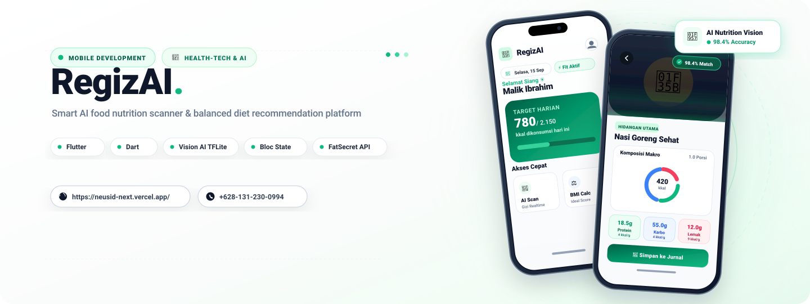
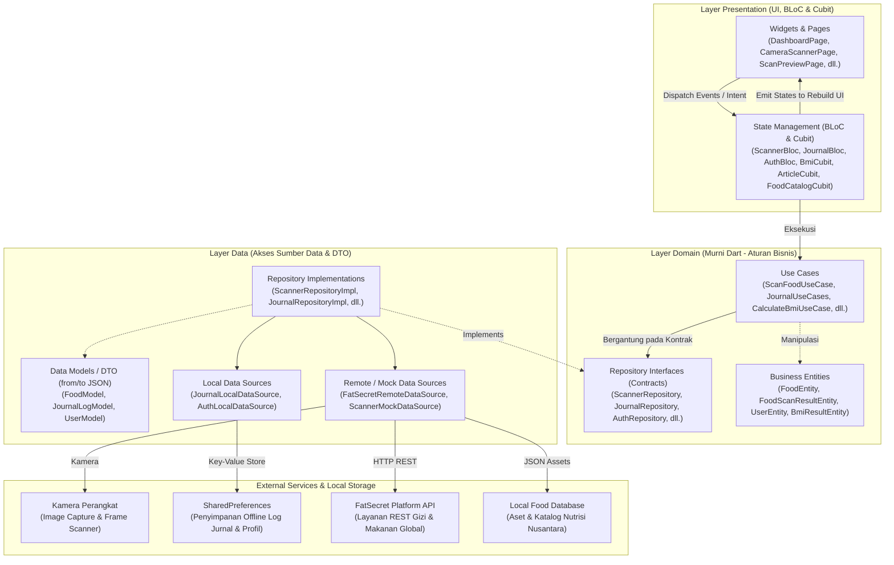
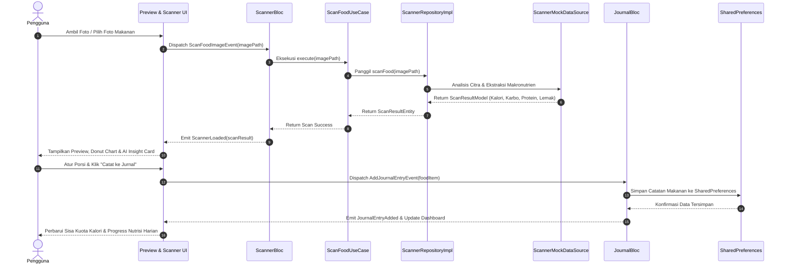

# 🥗 RegizAI (Smart AI Nutrition & Calorie Assistant)

<p align="center">
  
</p>

<p align="center">
  <strong>Sistem Rekomendasi Gizi Seimbang Berbasis AI & Smart Nutrition Mobile Application</strong><br>
  <em>"Pantau Nutrisi Harian, Capai Berat Ideal, dan Terapkan Pedoman Isi Piringku Bersama AI"</em>
</p>

<p align="center">
  
  
  
  
  
  
  
</p>

<p align="center">
  
</p>

---

## 📖 Tentang RegizAI

**RegizAI** (*Sistem Rekomendasi Gizi Seimbang Berbasis AI* — Dokumen SRS No: `GL02.02-SRS-00`) adalah aplikasi mobile kesehatan cerdas berbasis **Flutter** yang dirancang untuk membantu masyarakat Indonesia memantau asupan nutrisi harian, menjaga berat badan ideal, dan menerapkan pedoman gizi seimbang (**Isi Piringku**) sesuai standar **Kementerian Kesehatan Republik Indonesia**.

Aplikasi ini mengatasi masalah beban ganda malnutrisi (*double burden of malnutrition*)—mulai dari defisiensi gizi mikro hingga obesitas dan penyakit metabolik (diabetes melitus, hipertensi, penyakit kardiovaskular)—dengan menghadirkan asisten nutrisi berbasis **Computer Vision AI**. Melalui pemindaian piring makanan secara instan, pengguna dapat mengetahui estimasi kalori, kandungan makronutrien (Karbohidrat, Protein, Lemak), rekomendasi porsi ideal, serta mendapatkan wawasan gizi personal secara cepat, praktis, dan akurat.

Dibangun dengan fondasi arsitektur **Clean Architecture (Uncle Bob)** dan manajemen status **BLoC (`flutter_bloc`) / Cubit**, RegizAI dirancang modular, berkinerja tinggi, mudah diuji (*testable*), serta mengusung pendekatan *offline-first* dengan persistensi lokal `SharedPreferences` sehingga tetap andal digunakan kapan saja.

---

## ✨ Fitur Utama

- 📷 **AI Food Scanner & Computer Vision Analysis**
  - Pemindaian visual piring makanan secara instan memanfaatkan kamera ponsel atau galeri foto.
  - Estimasi otomatis total kalori (**kcal**) dan breakdown makronutrien (**Karbohidrat, Protein, Lemak**).
  - Tampilan interaktif **Nutrition Donut Chart** dan kartu wawasan **AI Insight Card** dengan saran langsung dari pakar gizi.
  - Penyesuaian takaran porsi secara fleksibel (gramasi dan sajian).

- 📊 **Health & Calorie Dashboard**
  - Pemantauan real-time batas target kalori harian, kalori yang telah dikonsumsi, dan sisa kuota kalori.
  - Indikator cincin kalori dinamis (*Circular Calorie Ring*) dan *Macro Progress Bar*.
  - Salam personalisasi pintar berbasis waktu (*Selamat Pagi, Siang, Sore, Malam*) dan status kebugaran harian.

- 🥗 **Katalog Makanan Sehat Nusantara (Isi Piringku)**
  - Direktori komprehensif makanan lokal Indonesia lengkap dengan profil nilai gizi per porsi.
  - Filter kategori praktis: *Makanan Pokok, Lauk Hewani, Lauk Nabati, Sayuran, dan Buah-buahan*.
  - Integrasi pencarian nutrisi online via **FatSecret API** dan basis data lokal offline.

- ⚖️ **Kalkulator IMT / BMI Akurat**
  - Perhitungan Indeks Massa Tubuh (IMT) presisi berdasarkan tinggi dan berat badan pengguna.
  - Klasifikasi status gizi sesuai standar Kemenkes RI & WHO (*Kurus / Berat Kurang, Normal, Gemuk / Berlebih, Obesitas*).
  - Rekomendasi berat badan ideal dan penyesuaian target asupan kalori harian.

- 📝 **Catatan Jurnal Konsumsi Harian**
  - Pencatatan menu makanan yang dikonsumsi terbagi menurut waktu makan (*Sarapan, Makan Siang, Makan Malam, Camilan*).
  - Penyimpanan data lokal persisten (*offline persistence*) berbasis `SharedPreferences`.

- 📰 **Artikel & Edukasi Pola Hidup Sehat**
  - Pustaka artikel edukatif mengenai hidrasi tubuh, sarapan seimbang, pencegahan penyakit degeneratif, dan tips hidup aktif.
  - Informasi berbasis bukti ilmiah (*evidence-based*) yang mudah dipahami oleh masyarakat umum.

- 👤 **Profil Pengguna & Personalisasi Fisik (BMR/TDEE)**
  - Pengelolaan data fisik (usia, jenis kelamin, tinggi badan, berat badan, tingkat aktivitas fisik).
  - Personalisasi kebutuhan kalori harian berbasis perhitungan *Basal Metabolic Rate* (BMR) dan *Total Daily Energy Expenditure* (TDEE).

---

## 🏗️ Arsitektur Sistem

RegizAI mengadopsi prinsip **Clean Architecture** yang membagi kode ke dalam lapisan independen (*Separation of Concerns*). Hal ini memastikan bahwa logika bisnis aplikasi (*Domain Layer*) murni ditulis dalam Dart dan sepenuhnya independen dari framework UI (Flutter), basis data, maupun pustaka eksternal.

### 1. Diagram Layer Clean Architecture & BLoC



### 2. Diagram Alir Pemindaian Makanan & Log Nutrisi (End-to-End)

Diagram sekuensial berikut mengilustrasikan alur kerja saat pengguna mengambil foto makanan, diproses oleh AI Scanner, hingga tersimpan dalam Jurnal Harian:



### 3. Penjelasan Layer Arsitektur

1. **Layer Presentation (`lib/features/[fitur]/presentation/`)**
   - **BLoC & Cubit**: Mengelola alur status secara reaktif dan terprediksi (*predictable state*). Menerima *Event* dari antarmuka pengguna, memicu proses di *Use Case*, dan memancarkan (*emit*) *State* baru.
   - **Pages & Widgets**: Komponen antarmuka yang mengonsumsi state via `BlocBuilder` atau `BlocConsumer`. Murni bertugas merender UI tanpa logika pemanggilan data langsung.

2. **Layer Domain (`lib/features/[fitur]/domain/`)**
   - **Entities**: Objek model bisnis murni tanpa ketergantungan pada parser JSON maupun pustaka pihak ketiga.
   - **Repository Contracts**: *Interface* abstrak murni yang mendefinisikan operasi data yang diizinkan dalam fitur.
   - **Use Cases**: Komponen yang mengemas aturan bisnis spesifik (misalnya `ScanFoodUseCase`, `CalculateBmiUseCase`, `GetFoodsUseCase`).

3. **Layer Data (`lib/features/[fitur]/data/`)**
   - **Models**: Data Transfer Object (DTO) yang memetakan data mentah (JSON / Map) ke format yang dapat digunakan oleh aplikasi (`fromJson`, `toJson`).
   - **Data Sources**:
     - *Remote Data Source*: Mengelola interaksi jaringan ke API eksternal (FatSecret REST API).
     - *Local Data Source*: Mengelola penyimpanan lokal offline via `SharedPreferences`.
     - *Mock Data Source*: Menyediakan simulasi data cerdas untuk pengujian tanpa ketergantungan koneksi.
   - **Repository Implementation**: Mengimplementasikan kontrak interface dari Domain layer dengan mengorkestrasikan *Data Sources*.

4. **Core & App Configuration (`lib/core/` & `lib/app/`)**
   - **`core/di/`**: Inisialisasi *Dependency Injection* menggunakan **GetIt** (`sl`) untuk menghubungkan implementasi ke abstraksi secara *loose coupling*.
   - **`core/errors/`**: Standarisasi kegagalan (*Failure*) dan pengecualian (*Exception*) untuk penanganan error yang konsisten.
   - **`core/theme/`**: Konfigurasi tema terpusat (Material 3, color palette hijau segar, card tokens, dan tipografi).
   - **`app/config/routes/`**: Manajemen navigasi terpusat berbasis *Named Routes*.

---

## 🛠️ Teknologi & Dependensi

| Kategori | Teknologi / Pustaka | Versi | Deskripsi |
| :--- | :--- | :--- | :--- |
| **Framework** | [Flutter](https://flutter.dev) | SDK `>=3.3.4 <4.0.0` | Framework UI multiplatform modern |
| **Bahasa** | [Dart](https://dart.dev) | 3.x | Bahasa pemrograman utama berorientasi objek & bertipe kuat |
| **State Management** | [flutter_bloc](https://pub.dev/packages/flutter_bloc) | `^9.1.1` | State management teruji berbasis aliran event dan state reaktif |
| **Value Equality** | [equatable](https://pub.dev/packages/equatable) | `^2.1.0` | Mempermudah perbandingan nilai objek tanpa boilerplate code |
| **Dependency Injection** | [get_it](https://pub.dev/packages/get_it) | `^9.2.1` | Service locator cepat untuk injeksi dependensi antar layer |
| **Penyimpanan Lokal** | [shared_preferences](https://pub.dev/packages/shared_preferences) | `^2.2.3` | Penyimpanan persisten lokal offline-first untuk profil & jurnal |
| **Komunikasi Jaringan** | [http](https://pub.dev/packages/http) | `^1.6.0` | Klien HTTP untuk integrasi API katalog nutrisi online |
| **Keamanan & Kriptografi** | [crypto](https://pub.dev/packages/crypto) | `^3.0.7` | Algoritma hashing (HMAC-SHA1) untuk otentikasi REST API |
| **Format Waktu & Tanggal** | [intl](https://pub.dev/packages/intl) | `^0.19.0` | Penanganan lokalisasi tanggal, jam, dan penomoran standar Indonesia |
| **Ikonografi & UI** | [cupertino_icons](https://pub.dev/packages/cupertino_icons) | `^1.0.8` | Ikon iOS & Android modern pelengkap antarmuka Material 3 |

---

## 📂 Struktur Direktori (Clean Architecture)

```text
lib/
├── app/
│   └── config/                    # Konfigurasi global aplikasi
│       ├── app.dart               # Root widget (RegizAIApp) & MaterialApp
│       ├── app_config.dart        # Environment config (dev/staging/prod)
│       └── routes/
│           └── app_routes.dart    # Definisi named routing & navigasi
│
├── core/                          # Komponen reusable lintas fitur
│   ├── constants/
│   │   └── app_constants.dart     # Konstanta global (storage keys, default target kalori)
│   ├── di/
│   │   └── injection_container.dart # Service locator GetIt setup
│   ├── errors/
│   │   ├── exceptions.dart        # Definisi Exception
│   │   └── failures.dart          # Definisi Failure
│   ├── theme/
│   │   └── app_theme.dart         # Material 3 theme tokens, palet warna, tipografi
│   ├── usecase/
│   │   └── usecase.dart           # Generic UseCase contract
│   └── utils/
│       ├── date_formatter.dart    # Formatter tanggal & waktu lokal bahasa Indonesia
│       └── input_validators.dart  # Validasi input form (email, password, angka)
│
├── features/                      # Modul fitur yang berdiri sendiri (Modular)
│   ├── ai_scanner/                # Fitur Pemindai Makanan AI & Analisis Nutrisi
│   │   ├── data/
│   │   │   ├── datasources/       # ScannerMockDataSource
│   │   │   ├── models/            # ScanResultModel (DTO)
│   │   │   └── repositories/      # ScannerRepositoryImpl
│   │   ├── domain/
│   │   │   ├── entities/          # ScanResultEntity
│   │   │   ├── repositories/      # ScannerRepository (Contract)
│   │   │   └── usecases/          # ScanFoodUseCase
│   │   └── presentation/
│   │       ├── bloc/              # ScannerBloc (State Management)
│   │       ├── pages/             # CameraScannerPage, ScanPreviewPage
│   │       └── widgets/           # NutritionDonutChart, AIInsightCard, ScannerHudWidget
│   │
│   ├── journal/                   # Fitur Dashboard Kalori & Catatan Konsumsi
│   │   ├── data/
│   │   │   ├── datasources/       # JournalLocalDataSource (SharedPreferences)
│   │   │   ├── models/            # JournalLogModel
│   │   │   └── repositories/      # JournalRepositoryImpl
│   │   ├── domain/
│   │   │   ├── entities/          # JournalLogEntity
│   │   │   ├── repositories/      # JournalRepository (Contract)
│   │   │   └── usecases/          # JournalUseCases (Add, Get, Delete, Clear)
│   │   └── presentation/
│   │       ├── bloc/              # JournalBloc
│   │       ├── pages/             # DashboardPage, JournalPage
│   │       └── widgets/           # CalorieSummaryCard, CircularCalorieRing, MacroBarWidget, FloatingNavBar
│   │
│   ├── food_catalog/              # Fitur Direktori Makanan Sehat Lokal Nusantara
│   │   ├── data/
│   │   │   ├── datasources/       # FatSecretRemoteDataSource, FoodMockDataSource
│   │   │   ├── models/            # FoodModel
│   │   │   └── repositories/      # FoodRepositoryImpl
│   │   ├── domain/
│   │   │   ├── entities/          # FoodEntity
│   │   │   ├── repositories/      # FoodRepository (Contract)
│   │   │   └── usecases/          # GetFoodsUseCase
│   │   └── presentation/
│   │       ├── cubit/             # FoodCatalogCubit
│   │       ├── pages/             # FoodCatalogPage, FoodDetailPage
│   │       └── widgets/           # FoodItemCard
│   │
│   ├── bmi/                       # Fitur Kalkulator IMT & Rekomendasi Gizi
│   │   ├── domain/
│   │   │   ├── entities/          # BmiEntity
│   │   │   └── usecases/          # CalculateBmiUseCase
│   │   └── presentation/
│   │       ├── cubit/             # BmiCubit
│   │       ├── pages/             # BmiCalculatorPage, BmiResultPage
│   │       └── widgets/           # BmiGaugeWidget
│   │
│   ├── articles/                  # Fitur Edukasi & Artikel Kesehatan Gizi
│   │   ├── domain/
│   │   │   ├── entities/          # ArticleEntity
│   │   │   └── usecases/          # GetArticlesUseCase
│   │   └── presentation/
│   │       ├── cubit/             # ArticleCubit
│   │       ├── pages/             # ArticlesPage, ArticleDetailPage
│   │       └── widgets/           # ArticleCardWidget
│   │
│   └── auth/                      # Fitur Profil Pengguna & Data Fisik
│       ├── data/
│       │   ├── datasources/       # AuthLocalDataSource
│       │   ├── models/            # UserModel
│       │   └── repositories/      # AuthRepositoryImpl
│       ├── domain/
│       │   ├── entities/          # UserEntity
│       │   ├── repositories/      # AuthRepository (Contract)
│       │   └── usecases/          # Login, SignUp, EditProfile, GetCurrentUser, Logout, ForgotPassword
│       └── presentation/
│           ├── bloc/              # AuthBloc
│           ├── pages/             # LoginPage, SignUpPage, BiodataPage, GenderPage, ProfilePage, EditProfilePage
│           └── widgets/           # AuthTextField
│
└── main.dart                      # Titik awal masuk aplikasi (Main Entry Point)
```

---

## 🚀 Memulai (Getting Started)

### Prasyarat
Sebelum menjalankan proyek ini, pastikan komputer Anda telah terpasang:
- [Flutter SDK](https://docs.flutter.dev/get-started/install) (versi 3.3.4 atau yang lebih baru)
- [Dart SDK](https://dart.dev/get-dart)
- Editor yang didukung: VS Code atau Android Studio dengan plugin Flutter & Dart
- Emulator Android (API Level 26+) atau perangkat fisik Android/iOS yang terhubung

### Langkah Instalasi

1. **Clone repositori**:
   ```bash
   git clone https://github.com/neusid/regizai_app.git
   cd regizai_app
   ```

2. **Pasang dependensi**:
   ```bash
   flutter pub get
   ```

3. **Jalankan analisis kode (Code Quality)**:
   ```bash
   flutter analyze
   ```

4. **Jalankan pengujian unit & widget**:
   ```bash
   flutter test
   ```

5. **Jalankan aplikasi**:
   ```bash
   flutter run
   ```

---

## 📱 Alur Penggunaan

1. **Pendaftaran & Pengisian Data Fisik**:
   - Pengguna membuat akun baru dan mengisi data fisik (usia, tinggi badan, berat badan, serta jenis kelamin).
   - Aplikasi secara otomatis mengalkulasikan estimasi kebutuhan energi dan batas target kalori harian.

2. **Pemindaian Makanan (AI Scanner)**:
   - Tekan ikon pemindai di bilah navigasi utama (*Floating Nav Bar*).
   - Arahkan kamera ke piring makanan atau unggah foto piring makanan dari galeri.
   - AI Scanner menganalisis gambar untuk mengidentifikasi menu, mengestimasi kalori (kcal), dan memecah rasio makronutrien.
   - Periksa **Nutrition Donut Chart** dan saran ahli gizi pada **AI Insight Card**, sesuaikan takaran porsi bila perlu.

3. **Catat ke Jurnal Konsumsi**:
   - Tekan tombol **"Catat ke Jurnal"** untuk memasukkan makanan ke dalam log harian (*Sarapan, Makan Siang, Makan Malam, atau Camilan*).
   - Data langsung tersimpan secara aman di penyimpanan lokal perangkat.

4. **Pantau Dashboard Kalori**:
   - Kembali ke halaman beranda untuk melihat sisa target kalori yang belum terpenuhi dan progres pemenuhan karbohidrat, protein, serta lemak harian.

5. **Cek Indeks Massa Tubuh (IMT)**:
   - Masuk ke menu **Kalkulator IMT** untuk memantau status gizi terkini dan mendapatkan anjuran penyesuaian gaya hidup sehat.

---

## 🌿 Pedoman Komposisi Piring Sehat (Isi Piringku)

RegizAI mengacu pada pedoman **Isi Piringku** dari Kementerian Kesehatan RI dalam setiap rekomendasi yang diberikan:

| Komponen Piring | Proporsi Ideal | Contoh Sumber Bahan Pangan |
| :--- | :--- | :--- |
| 🍚 **Makanan Pokok** | **~33% (2/3 dari 1/2 piring)** | Beras merah/putih, jagung, singkong, ubi jalar, kentang, havermut |
| 🥦 **Sayur-sayuran** | **~33% (2/3 dari 1/2 piring)** | Bayam, kangkung, sawi, wortel, buncis, brokoli, labu siam |
| 🍗 **Lauk-Pauk** | **~17% (1/3 dari 1/2 piring)** | Tempe, tahu, ikan, telur, ayam tanpa kulit, daging tanpa lemak |
| 🍎 **Buah-buahan** | **~17% (1/3 dari 1/2 piring)** | Pepaya, pisang, jeruk, apel, semangka, mangga, alpukat |

---

## 📄 Lisensi & Hak Cipta

Dikelola dan dikembangkan oleh tim pengembang **RegizAI**. Seluruh hak cipta dilindungi undang-undang.
